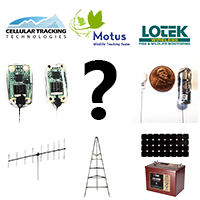

# Motus Guides

Select a guide from the list below.

| General |  |
| :--- | :---: |
| [Motus Station Guide](https://docs.motus.org/stationguide/) |  |
| [Data Analysis](https://motus.org/MotusRBook/) |  |
| [Equipment Selection](https://motus.org/selection-guide) |  |
| [**\[DRAFT\]** Motus Tag Guide](https://docs.motus.org/tagguide) |  |
| [Troubleshooting](https://motus.org/troubleshooting-guide/) |  |
| **Receiver manuals** |  |
| [SensorGnome Guide](https://motus.gitbook.io/sensorgnome/) |  |
| [CTT SensorStation Installation](https://store.celltracktech.com/pages/installation-guides) |  |
| [Lotek SRX-800 User Manual \(unofficial\)](https://fccid.io/FW9SRX800/User-Manual/User-Manual-2328127) |  |

