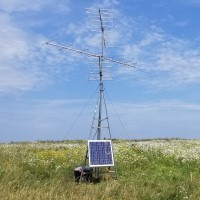
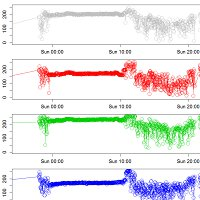
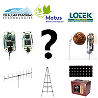

# Motus Guides

Select a guide from the list below.

| General |  |
| :--- | :---: |
| [**Motus Station Guide**](https://docs.motus.org/stationguide/) |  |
| **[Data Analysis](https://motus.org/MotusRBook/)** |  |
| [**Equipment Selection**](https://motus.org/selection-guide) |  |
| [**\[DRAFT\] Motus Tag Guide**](https://docs.motus.org/tagguide) |  |
| [**Troubleshooting**](https://motus.org/troubleshooting-guide/) |  |
| **Receiver manuals** |  |
| [**SensorGnome Guide**](https://motus.gitbook.io/sensorgnome/) |  |
| [**CTT SensorStation Installation**](https://store.celltracktech.com/pages/installation-guides) |  |
| [**Lotek SRX-800 User Manual \(unofficial\)**](https://store.celltracktech.com/pages/installation-guides) |  |
