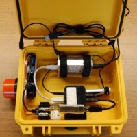

# Motus Guides

<table style='border-width:0px;'>
<thead>
<th style='text-align:center;border-width:0px;'><a href='https://docs.motus.org/stationguide'>Motus Station Guide</a></th>
<th style='text-align:center;border-width:0px;'><a href='https://docs.motus.org/tagguide'>Motus Tag Guide</a></th>
<th style='text-align:center;border-width:0px;'><a href='https://motus.org/MotusRBook'>Motus Data Analysis</a></th>
</thead>
<tbody>
<tr>
<td style='text-align:center;border-width:0px;'></td>
<td style='text-align:center;border-width:0px;'></td>
<td style='text-align:center;border-width:0px;'></td>
</tr>
</tbody>
</table>
<table>
<thead>
<th style='text-align:center;border-width:0px;'><a href='https://motus.org/selection-guide'>Equipment selection</a></th>
<th style='text-align:center;border-width:0px;'><a href='https://motus.org/troubleshooting-guide'>Troubleshooting</a></th>
</thead>
<tbody>
<tr>
<td style='text-align:center;border-width:0px;'></td>
<td style='text-align:center;border-width:0px;'></td>
</tr>
</tbody>
</table>

# Receiver manuals
<table style='border-width:0px;'>
<thead>
<th style='text-align:center;border-width:0px;'><a href='https://docs.motus.org/sensorgnome'>SensorGnome User Guide</a></th>
<th style='text-align:center;border-width:0px;'><a href='https://store.celltracktech.com/pages/installation-guides'>SensorStation Installation</a></th>
<th style='text-align:center;border-width:0px;'><a href='https://fccid.io/FW9SRX800/User-Manual/User-Manual-2328127'>Lotek SRX-800 User Manual (unofficial)</a></th>
</thead>
<tbody>
<tr>
<td style='text-align:center;border-width:0px;'></td>
<td style='text-align:center;border-width:0px;'></td>
<td style='text-align:center;border-width:0px;'></td>
</tr>
</tbody>
</table>
